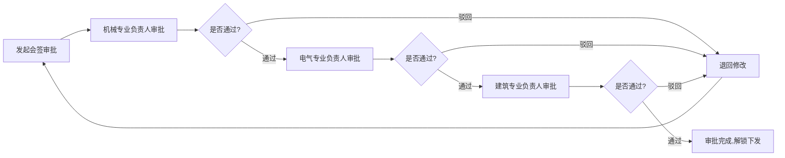

## 1. 产品概述

工程图纸版本管理系统是面向制造业和建筑设计团队的专业图纸全生命周期管理平台，解决图纸版本混乱、审批流程不规范、变更追溯困难等核心问题。

- 主要用途：图纸分类存储、版本管理、在线审阅、审批会签、变更通知、外部协作
- 目标用户：制造企业、建筑设计院、施工单位、供应商等工程相关方
- 核心价值：确保图纸版本唯一性、规范审批流程、完整追溯变更历史、保障施工安全、提升跨部门协作效率

## 2. 核心特性

### 2.1 用户角色

| 角色 | 注册方式 | 核心权限 |
|------|---------|---------|
| 系统管理员 | 后台创建 | 用户管理、角色权限配置、系统设置 |
| 项目负责人 | 管理员创建 | 项目创建与管理、图纸上传、发起审批流程 |
| 设计师 | 管理员创建 | 图纸上传、版本提交、修改说明填写 |
| 专业负责人 | 管理员创建 | 图纸审阅、添加标注、会签审批 |
| 下游部门用户 | 管理员创建 | 查看已发布图纸、接收ECN通知 |
| 外部合作方 | 无需注册 | 通过临时链接查阅指定图纸 |

### 2.2 功能模块

1. **仪表盘**：项目概览、待办审批、最近变更、统计数据
2. **项目管理**：项目创建、编辑、归档、成员管理
3. **专业分类**：机械、电气、建筑、给排水、暖通等专业分类管理
4. **图纸管理**：图纸上传、分类存储、搜索筛选、批量操作
5. **版本管理**：版本提交、变更说明、历史版本对比、版本回滚
6. **在线预览**：CAD/PDF格式图纸在线查看、缩放、平移、图层控制
7. **审阅标注**：矩形/圆形/箭头标注、文字注释、标注列表、标注状态管理
8. **审批流程**：发起会签、依次审批、签字确认、审批状态追踪、未审批锁定下发
9. **变更通知(ECN)**：ECN创建、关联图纸、通知下游部门、确认回执
10. **外部协作**：临时链接生成、有效期设置、访问权限控制、访问记录审计
11. **系统设置**：用户管理、角色配置、专业设置、操作日志

### 2.3 页面详情

| 页面名称 | 模块名称 | 功能描述 |
|---------|---------|---------|
| 登录页 | 登录表单 | 用户名密码登录、记住我、忘记密码 |
| 仪表盘 | 概览面板 | 项目数量、图纸总数、待审批数、最近变更列表、待办任务 |
| 项目列表页 | 项目卡片 | 项目列表展示、筛选搜索、新建项目、项目详情入口 |
| 项目详情页 | 专业分类 | 项目信息展示、专业分类树、各专业图纸数量统计 |
| 图纸列表页 | 图纸表格 | 图纸列表、版本号、状态、上传人、上传时间、搜索筛选 |
| 图纸上传页 | 上传表单 | 图纸上传、选择专业、填写名称图号、初始版本说明 |
| 图纸详情页 | 版本历史 | 图纸信息、版本列表、变更说明、版本对比、预览入口 |
| 图纸预览页 | 在线预览 | CAD/PDF预览、缩放平移、图层控制、标注工具栏 |
| 标注管理页 | 标注列表 | 标注列表、状态筛选、回复标注、标注详情 |
| 审批列表页 | 审批卡片 | 待我审批、我发起的、已完成、审批详情 |
| 审批详情页 | 审批流程 | 审批流程图、会签节点、签字确认、审批意见 |
| ECN列表页 | ECN表格 | ECN列表、关联图纸、通知状态、详情入口 |
| ECN详情页 | ECN信息 | ECN详情、关联图纸列表、通知部门、确认回执 |
| 外部链接页 | 链接管理 | 链接列表、生成链接、有效期设置、访问记录 |
| 用户管理页 | 用户表格 | 用户列表、新建用户、编辑用户、禁用用户 |
| 角色管理页 | 角色表格 | 角色列表、权限配置、编辑角色 |

## 3. 核心流程

### 3.1 图纸版本提交流程
设计师上传图纸新版本 → 填写变更说明 → 系统自动生成版本号 → 关联原图纸历史版本 → 通知相关人员

### 3.2 审批会签流程
项目负责人发起审批 → 依次发送给各专业负责人 → 专业负责人审阅并添加标注 → 签字确认 → 全部通过后解锁下发权限

### 3.3 ECN变更通知流程
创建ECN → 关联被修改图纸 → 选择通知下游部门 → 发送通知 → 部门确认回执 → 记录通知状态

### 3.4 外部访问流程
生成临时链接 → 设置有效期和访问权限 → 发送给外部合作方 → 合作方通过链接访问 → 系统记录访问日志

## 4. 用户界面设计

### 4.1 设计风格

**设计理念：工业科技风 + 专业严谨**
- 主色调：深蓝色系 (#0F3B86, #1E5BC6, #3A7BD5) - 代表专业、信任、可靠
- 辅助色：橙色 (#F59E0B) - 用于强调操作和警告状态
- 成功色：绿色 (#10B981) - 审批通过、正常状态
- 危险色：红色 (#EF4444) - 驳回、错误状态
- 中性色：深灰 (#1F2937)、中灰 (#6B7280)、浅灰 (#F3F4F6) - 文本和背景

**界面元素：**
- 按钮风格：直角边框、轻微阴影、悬停时有明显颜色变化和细微上浮效果
- 卡片风格：白色背景、1px浅灰边框、轻微阴影、悬停时阴影加深
- 输入框：1px边框、聚焦时主色边框高亮
- 字体：
  - 标题：思源黑体 Bold，16-24px
  - 正文：思源黑体 Regular，14px
  - 辅助文字：思源黑体 Light，12px
- 图标：使用线性图标，保持统一风格和24px尺寸
- 布局：顶部导航 + 左侧菜单 + 右侧内容区的经典企业级应用布局

### 4.2 页面设计概览

| 页面名称 | 模块名称 | UI元素 |
|---------|---------|--------|
| 登录页 | 登录表单 | 深蓝色背景、白色登录卡片、品牌Logo、输入框、登录按钮、渐变装饰 |
| 仪表盘 | 概览面板 | 数据卡片网格、统计图表、待办列表、最近变更时间线 |
| 项目列表页 | 项目卡片 | 卡片式布局、项目封面、项目名称、负责人、状态标签、创建时间 |
| 图纸列表页 | 图纸表格 | 数据表格、状态徽章、缩略图预览、搜索框、筛选器、批量操作工具栏 |
| 图纸预览页 | 在线预览 | 大尺寸预览区域、左侧缩略图、右侧属性面板、底部工具栏、标注图层 |
| 审批详情页 | 审批流程 | 垂直时间线、审批节点卡片、状态指示器、签字区域、审批意见输入框 |
| 外部链接页 | 链接管理 | 链接卡片、二维码展示、有效期倒计时、访问日志表格 |

### 4.3 响应式设计

- **桌面端优先**：优化1920x1080及以上分辨率，内容区最小宽度1200px
- **平板适配**：1024px及以下，左侧菜单可折叠，内容区自适应
- **移动端**：768px及以下，顶部导航简化为汉堡菜单，表格转为卡片列表展示
- **触控优化**：最小点击区域44x44px，按钮间距适当增加

### 4.4 动效设计

- 页面切换：淡入淡出 + 轻微位移，时长300ms
- 卡片悬停：上移2px + 阴影加深，时长200ms
- 按钮点击：缩放95%后回弹，时长150ms
- 审批状态更新：状态徽章颜色渐变过渡，时长500ms
- 标注添加：从标注点向外扩散的圆形波纹效果
- 通知提示：右上角滑入，停留3秒后滑出
