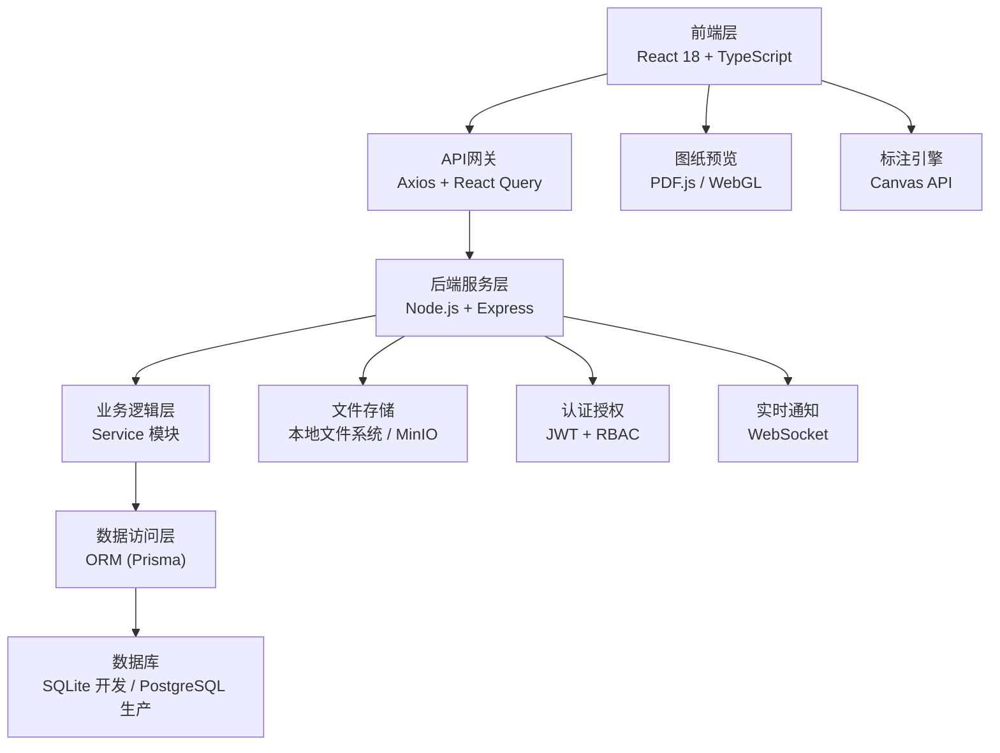
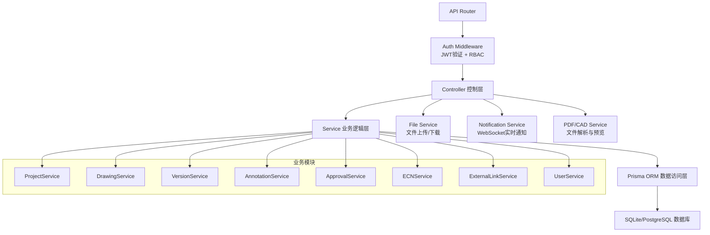
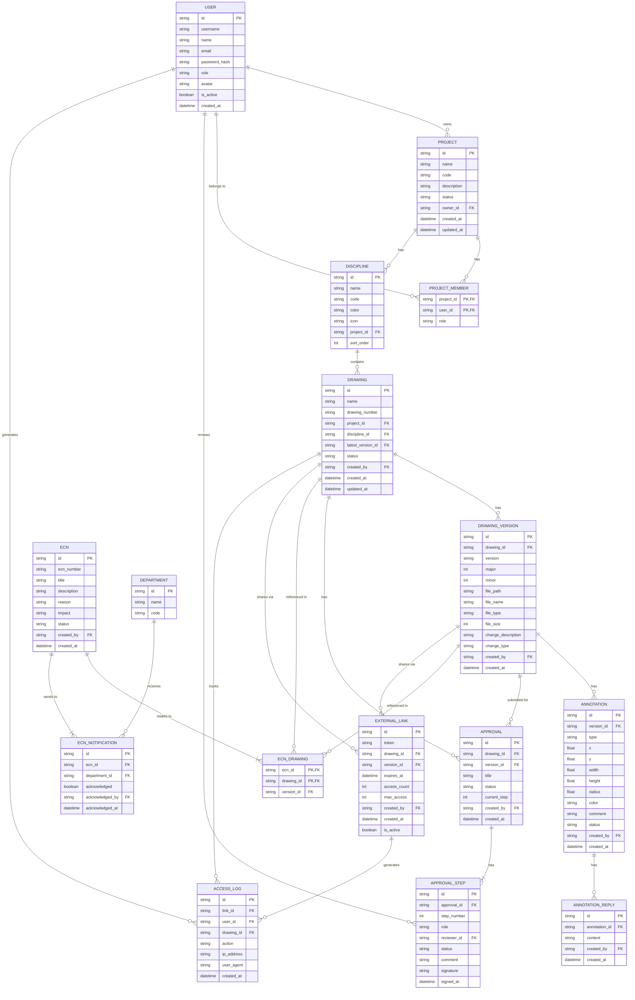

## 1. 架构设计



## 2. 技术描述

### 2.1 前端技术栈
- **框架**: React 18 + TypeScript 5
- **构建工具**: Vite 5
- **路由**: React Router v6
- **状态管理**: Zustand + React Query (TanStack Query)
- **UI组件库**: Ant Design 5
- **样式**: TailwindCSS 3 + CSS Modules
- **图表**: Recharts
- **PDF预览**: react-pdf (基于PDF.js)
- **CAD预览**: 模拟WebGL渲染 + SVG层
- **标注引擎**: 自定义Canvas组件
- **图标**: @ant-design/icons + lucide-react
- **动画**: Framer Motion

### 2.2 后端技术栈
- **运行环境**: Node.js 20
- **框架**: Express 4
- **语言**: TypeScript
- **ORM**: Prisma 5
- **数据库**: SQLite (开发) / PostgreSQL (生产)
- **认证**: JWT + bcrypt
- **权限**: RBAC (基于角色的访问控制)
- **文件上传**: Multer
- **API文档**: Swagger/OpenAPI 3.0
- **实时通信**: Socket.io

### 2.3 工程化配置
- **代码规范**: ESLint + Prettier
- **Git钩子**: Husky + lint-staged
- **类型检查**: TypeScript strict模式
- **环境变量**: dotenv
- **测试**: Vitest + React Testing Library

## 3. 路由定义

| 路由 | 页面 | 说明 |
|------|------|------|
| `/login` | 登录页 | 用户认证入口 |
| `/dashboard` | 仪表盘 | 数据概览和待办事项 |
| `/projects` | 项目列表 | 所有项目列表展示 |
| `/projects/:id` | 项目详情 | 项目信息和专业分类 |
| `/projects/:id/disciplines/:disciplineId` | 图纸列表 | 某专业下的所有图纸 |
| `/drawings/:id` | 图纸详情 | 图纸信息和版本历史 |
| `/drawings/:id/preview` | 图纸预览 | 在线预览和标注 |
| `/drawings/:id/versions/:versionId` | 版本详情 | 特定版本的详细信息 |
| `/approvals` | 审批列表 | 待审批和已审批列表 |
| `/approvals/:id` | 审批详情 | 审批流程和会签操作 |
| `/ecns` | ECN列表 | 变更通知列表 |
| `/ecns/:id` | ECN详情 | 变更通知详情和回执 |
| `/external-links` | 外部链接 | 临时链接管理 |
| `/external/:token` | 外部访问 | 合作方访问页面 |
| `/settings/users` | 用户管理 | 用户列表和管理 |
| `/settings/roles` | 角色管理 | 角色和权限配置 |
| `/settings/disciplines` | 专业设置 | 专业分类管理 |
| `/audit/access-logs` | 访问日志 | 访问记录审计 |

## 4. API 定义

### 4.1 类型定义

```typescript
// 用户
interface User {
  id: string;
  username: string;
  name: string;
  email: string;
  role: Role;
  avatar?: string;
  isActive: boolean;
  createdAt: string;
}

type Role = 'admin' | 'project_manager' | 'designer' | 'reviewer' | 'viewer' | 'external';

// 项目
interface Project {
  id: string;
  name: string;
  code: string;
  description: string;
  status: 'active' | 'completed' | 'archived';
  ownerId: string;
  owner?: User;
  members: ProjectMember[];
  createdAt: string;
  updatedAt: string;
}

interface ProjectMember {
  projectId: string;
  userId: string;
  user?: User;
  role: 'manager' | 'member';
}

// 专业分类
interface Discipline {
  id: string;
  name: string;
  code: string;
  color: string;
  icon: string;
  projectId: string;
  sortOrder: number;
}

// 图纸
interface Drawing {
  id: string;
  name: string;
  drawingNumber: string;
  projectId: string;
  disciplineId: string;
  discipline?: Discipline;
  latestVersionId: string;
  latestVersion?: DrawingVersion;
  status: 'draft' | 'reviewing' | 'approved' | 'released';
  createdBy: string;
  createdAt: string;
  updatedAt: string;
}

// 图纸版本
interface DrawingVersion {
  id: string;
  drawingId: string;
  version: string;
  major: number;
  minor: number;
  filePath: string;
  fileName: string;
  fileType: 'pdf' | 'dwg' | 'dxf';
  fileSize: number;
  changeDescription: string;
  changeType: 'new' | 'revision' | 'correction' | 'superseded';
  createdBy: string;
  createdByUser?: User;
  createdAt: string;
  annotations: Annotation[];
}

// 标注
interface Annotation {
  id: string;
  versionId: string;
  type: 'rectangle' | 'circle' | 'arrow' | 'text';
  x: number;
  y: number;
  width?: number;
  height?: number;
  radius?: number;
  color: string;
  comment: string;
  status: 'open' | 'resolved' | 'closed';
  createdBy: string;
  createdByUser?: User;
  createdAt: string;
  replies: AnnotationReply[];
}

interface AnnotationReply {
  id: string;
  annotationId: string;
  content: string;
  createdBy: string;
  createdByUser?: User;
  createdAt: string;
}

// 审批流程
interface Approval {
  id: string;
  drawingId: string;
  drawing?: Drawing;
  versionId: string;
  version?: DrawingVersion;
  title: string;
  status: 'pending' | 'reviewing' | 'approved' | 'rejected';
  currentStep: number;
  createdBy: string;
  createdByUser?: User;
  createdAt: string;
  steps: ApprovalStep[];
}

interface ApprovalStep {
  id: string;
  approvalId: string;
  stepNumber: number;
  role: string;
  reviewerId?: string;
  reviewer?: User;
  status: 'pending' | 'approved' | 'rejected';
  comment?: string;
  signature?: string;
  signedAt?: string;
}

// ECN变更通知
interface ECN {
  id: string;
  ecnNumber: string;
  title: string;
  description: string;
  reason: string;
  impact: string;
  status: 'draft' | 'issued' | 'acknowledged';
  createdBy: string;
  createdByUser?: User;
  createdAt: string;
  drawings: ECNDrawing[];
  notifications: ECNNotification[];
}

interface ECNDrawing {
  ecnId: string;
  drawingId: string;
  drawing?: Drawing;
  versionId: string;
  version?: DrawingVersion;
}

interface ECNNotification {
  id: string;
  ecnId: string;
  departmentId: string;
  department: Department;
  acknowledged: boolean;
  acknowledgedBy?: string;
  acknowledgedAt?: string;
}

interface Department {
  id: string;
  name: string;
  code: string;
}

// 外部链接
interface ExternalLink {
  id: string;
  token: string;
  drawingId: string;
  drawing?: Drawing;
  versionId?: string;
  version?: DrawingVersion;
  expiresAt: string;
  accessCount: number;
  maxAccess: number;
  createdBy: string;
  createdAt: string;
  isActive: boolean;
  accessLogs: AccessLog[];
}

// 访问日志
interface AccessLog {
  id: string;
  linkId?: string;
  userId?: string;
  user?: User;
  drawingId: string;
  drawing?: Drawing;
  action: string;
  ipAddress?: string;
  userAgent?: string;
  createdAt: string;
}
```

### 4.2 API 接口列表

| 方法 | 路径 | 说明 |
|------|------|------|
| POST | `/api/auth/login` | 用户登录 |
| POST | `/api/auth/logout` | 用户登出 |
| GET | `/api/auth/me` | 获取当前用户信息 |
| GET | `/api/projects` | 获取项目列表 |
| POST | `/api/projects` | 创建项目 |
| GET | `/api/projects/:id` | 获取项目详情 |
| PUT | `/api/projects/:id` | 更新项目 |
| GET | `/api/projects/:id/disciplines` | 获取项目专业分类 |
| POST | `/api/projects/:id/disciplines` | 添加专业分类 |
| GET | `/api/disciplines/:id/drawings` | 获取专业下的图纸 |
| GET | `/api/drawings` | 获取图纸列表 |
| POST | `/api/drawings` | 创建图纸（上传） |
| GET | `/api/drawings/:id` | 获取图纸详情 |
| PUT | `/api/drawings/:id` | 更新图纸信息 |
| GET | `/api/drawings/:id/versions` | 获取图纸版本历史 |
| POST | `/api/drawings/:id/versions` | 上传新版本 |
| GET | `/api/drawings/versions/:id` | 获取版本详情 |
| GET | `/api/drawings/versions/:id/annotations` | 获取版本标注 |
| POST | `/api/drawings/versions/:id/annotations` | 添加标注 |
| PUT | `/api/annotations/:id` | 更新标注状态 |
| POST | `/api/annotations/:id/replies` | 添加标注回复 |
| GET | `/api/approvals` | 获取审批列表 |
| POST | `/api/approvals` | 发起审批流程 |
| GET | `/api/approvals/:id` | 获取审批详情 |
| POST | `/api/approvals/:id/steps/:stepId/sign` | 审批签字 |
| POST | `/api/approvals/:id/reject` | 驳回审批 |
| GET | `/api/ecns` | 获取ECN列表 |
| POST | `/api/ecns` | 创建ECN |
| GET | `/api/ecns/:id` | 获取ECN详情 |
| POST | `/api/ecns/:id/issue` | 发布ECN |
| POST | `/api/ecns/:id/acknowledge` | 确认ECN回执 |
| GET | `/api/external-links` | 获取外部链接列表 |
| POST | `/api/external-links` | 创建外部链接 |
| PUT | `/api/external-links/:id` | 更新外部链接 |
| GET | `/api/external/:token` | 通过token获取图纸信息（外部访问） |
| GET | `/api/users` | 获取用户列表 |
| POST | `/api/users` | 创建用户 |
| PUT | `/api/users/:id` | 更新用户 |
| GET | `/api/roles` | 获取角色列表 |
| GET | `/api/audit/access-logs` | 获取访问日志 |

## 5. 服务端架构图



## 6. 数据模型

### 6.1 ER 图



### 6.2 初始化数据

```sql
-- 初始用户
INSERT INTO user (id, username, name, email, password_hash, role, is_active) VALUES
('admin', 'admin', '系统管理员', 'admin@example.com', '$2b$10$...', 'admin', true),
('pm01', 'pm01', '张经理', 'pm01@example.com', '$2b$10$...', 'project_manager', true),
('designer01', 'designer01', '李设计', 'designer01@example.com', '$2b$10$...', 'designer', true),
('reviewer01', 'reviewer01', '王审校', 'reviewer01@example.com', '$2b$10$...', 'reviewer', true),
('viewer01', 'viewer01', '赵工', 'viewer01@example.com', '$2b$10$...', 'viewer', true);

-- 初始部门
INSERT INTO department (id, name, code) VALUES
('dept001', '生产部', 'PROD'),
('dept002', '采购部', 'PURC'),
('dept003', '质量部', 'QUAL'),
('dept004', '施工部', 'CONS');

-- 初始专业分类（系统默认）
INSERT INTO discipline (id, name, code, color, icon, project_id, sort_order) VALUES
('sys_mech', '机械', 'MECH', '#1E5BC6', 'setting', 'SYSTEM', 1),
('sys_elec', '电气', 'ELEC', '#F59E0B', 'zap', 'SYSTEM', 2),
('sys_arch', '建筑', 'ARCH', '#10B981', 'building', 'SYSTEM', 3),
('sys_pipe', '给排水', 'PIPE', '#06B6D4', 'droplets', 'SYSTEM', 4),
('sys_hvac', '暖通', 'HVAC', '#8B5CF6', 'wind', 'SYSTEM', 5);
```

## 7. Mock 数据设计

为了演示系统功能，将在前端和后端提供完整的Mock数据：

1. **演示项目**：包含2-3个完整项目，每个项目包含5个专业分类
2. **图纸数据**：每个专业分类包含8-12张图纸，每张图纸包含3-5个历史版本
3. **标注数据**：部分版本包含审阅标注，每个标注带有评论和回复
4. **审批流程**：包含待审批、审批中、已通过、已驳回等多种状态
5. **ECN数据**：包含草稿、已发布、已确认等状态的变更通知
6. **外部链接**：包含有效的临时链接示例
7. **访问日志**：包含完整的访问记录，用于审计展示

所有Mock数据将通过服务端API返回，确保前端可以无缝切换到真实后端。
